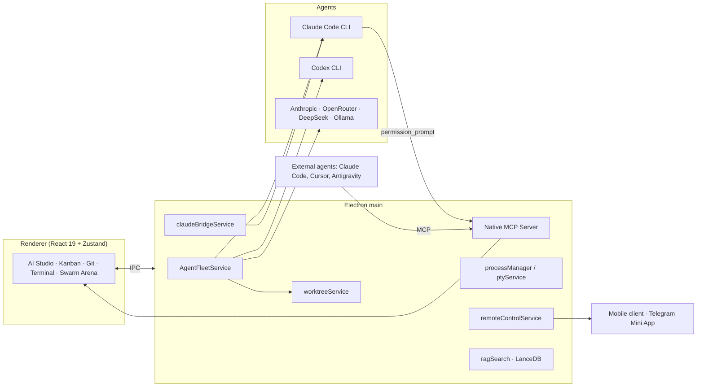

<p align="center">
  
</p>

<h1 align="center">ProjectHub</h1>

<p align="center">
  <b>Agentic Development Environment (ADE)</b><br/>
  A desktop command center where AI agents work as full members of the team, not as autocomplete in an editor.
</p>

<p align="center">
  <b>English</b> · <a href="README.ru.md">Русский</a>
</p>

<p align="center">
  
  
  
  
  
  
</p>

---

## Why an ADE, not an IDE

An IDE is built around one person typing code in one working directory. In 2026 that is no longer what development looks like. Code is written by agents: Claude Code, Codex, local models. The human sets tasks, monitors progress, makes decisions at critical points and picks the best result.

**ProjectHub** is designed for exactly this workflow. It is not an editor with a chat panel on the side, but an environment where:

- **The unit of work is a task, not a file.** Tasks live in `backlog/` as markdown, agents pick them up, and the board updates in real time.
- **There are many agents, and they work in parallel.** Each one gets its own Git worktree, its own branch and its own terminal. No conflicts in a shared working directory.
- **The human stays in the loop.** Every risky agent step goes through human-in-the-loop approval, which can be granted from the desktop, a phone or Telegram.
- **The environment is itself a tool for agents.** ProjectHub runs its own MCP server, through which external agents control projects, processes and the UI.
- **Project knowledge is available to both humans and machines.** Documentation, architecture decisions and tasks are indexed into a vector database and served to agents over MCP.

One screen instead of a dozen terminals, browser tabs and Git client windows.

---

## What ProjectHub does

### 🧠 AI agent orchestration

| Module | What it does |
|---|---|
| **AI Studio** | Full-screen agent chat with streaming output, reasoning blocks, interactive Tool Use cards and line-by-line Accept / Reject diff cards. Context tags `@Task`, `@GitStatus`, `@Docs`. |
| **Multi-provider** | Anthropic API, OpenRouter, DeepSeek, local Ollama and any OpenAI-compatible endpoint. Keys are stored via Electron `safeStorage`. |
| **Claude Code CLI wrapper** | AI Studio works as a GUI on top of Claude Code without an API key: sub-agent tree, status indicators on projects in the sidebar ("working", "awaiting decision", "done"), quota tracking. |
| **Human-in-the-loop** | Claude Code permission requests are intercepted by the built-in MCP server **before** the tool runs. The approval card appears in the GUI, the mobile client and Telegram. Cancelling the session = automatic `deny`. |
| **Swarm Arena** | One task is sent to several agents at once (fan-out): Claude Code, Codex CLI, API models. Each agent is isolated in its own worktree. The side-by-side view shows logs, metrics and diffs of every participant. **Pick Winner** merges the winning branch in one click and cleans up the rest. |
| **Handoff pipeline** | A chain of roles: architect writes the spec → coder implements → reviewer checks. The output of each stage becomes the input of the next. |
| **AI assistant for routine work** | Generates task descriptions, commit messages and PR descriptions from project context. |

### 🌿 Git as a first-class citizen

- Commit graph, branches, stash, stage/unstage, commits automatically linked to a task ID.
- Split / unified diff viewer with syntax highlighting.
- **Git worktrees**: create a worktree for a task straight from its card (`task/<id>` → `.worktrees/<id>`), terminals with `cwd` in the worktree, a completion dialog with diff and safe merge.
- **PR Hub**: GitHub and GitLab, creating PRs from a task branch, check statuses, automatic task transition to `Review` and `Done`.

### 📋 Project management on top of Backlog.md

- Automatic project discovery across drives and a registry with live indicators: branch, ahead/behind, uncommitted files, dev server and agent status.
- Kanban and table views with drag-and-drop, Acceptance Criteria checklists, tags and priorities. All changes are written in the native Backlog.md format.
- Milestones and a roadmap with per-stage progress.
- Documentation and ADRs (Architecture Decision Records) with a built-in Markdown editor and Mermaid diagrams.
- Project analytics: task completion, Git contributors, tag distribution, vector index statistics.
- New project wizard based on a template, with a choice of infrastructure modules.

### ⚙️ Runtime and processes

- Background process manager: dev servers, watchers, scripts. Start, stop, restart, live logs, protection against stuck ports.
- Built-in multi-terminal on `node-pty` + `xterm.js` with parallel Claude Code and shell sessions in any project or worktree directory.
- **Action Runner**: configurable Run / Test / Deploy buttons, settings stored in the project's `.projecthub.json`.
- File Explorer with Git badges and a quick editor.

### 🔍 Knowledge and interoperability

- Vector RAG search across the documentation of all projects (LanceDB + multilingual embeddings, `Ctrl+K`). The index is committed to the repository together with the documents.
- **ProjectHub Native MCP Server** (HTTP/SSE, `127.0.0.1:42042`, auth token): switching projects and tabs, sending prompts to AI Studio, managing processes, reading the backlog, HITL approvals. The config can be copied in one click for Claude Code, Claude Desktop, Cursor and other clients.
- Works with any MCP-capable agent: Claude Code, Google Antigravity, Cursor, Windsurf.

### 📡 Control from anywhere

- **Voice control**: navigation, starting processes, commits, dictation into AI Studio, hands-free mode. Web Speech API or local Whisper, customizable phrases and synonyms, hot-swapping headsets.
- **Remote Control**: a mobile web client for projects, tasks, processes, terminal and AI Studio. LAN Direct and Server Relay modes (Ed25519 identity, per-device tokens) with end-to-end AES-256-GCM encryption, QR code pairing.
- **Machine federation**: several machines running ProjectHub see each other in a directory (via your own relay or directly on the local network) and can open one another in hub mode — the remote machine's projects, tasks, processes, agents and HITL queue in the same UI. A task can be assigned to an agent on a specific machine: `assignee: agent:<role>@<hostId>`.
- **Telegram Mini App and bot**: a full client inside Telegram with native WebApp components, push notifications about crashed processes and HITL requests, an automatic HTTPS tunnel, and combining several developer machines into a single hub.
- Global hotkeys and a quick action palette.
- English and Russian UI with instant switching.

---

## Architecture at a glance



Every project managed by ProjectHub follows the same template: `backlog/` for tasks and documentation, a committed vector index `.rag-index/`, the `env-tools` process manager, and agent rules and MCP configs in `.claude/` and `.agents/`. ProjectHub understands this structure out of the box, and the project wizard sets it up in a single step.

---

## Tech stack

| Layer | Technologies |
|---|---|
| Desktop | Electron, Vite, electron-builder |
| UI | React 19, TypeScript 6, Tailwind CSS v4, Lucide, Zustand |
| Git | simple-git, Git worktrees, custom diff parser |
| Terminal and processes | node-pty, @xterm/xterm, tree-kill |
| AI and agents | Anthropic API, Claude Code CLI, Codex CLI, OpenRouter, DeepSeek, Ollama, @modelcontextprotocol/sdk |
| Knowledge | LanceDB, @huggingface/transformers (`multilingual-e5-small`), gray-matter, Mermaid |
| Voice | Web Speech API, local Whisper, AudioWorklet |
| Remote | WebSocket LAN Direct/Relay, Ed25519 identity, AES-256-GCM (Web Crypto), Telegram WebApp SDK |
| Quality | ESLint (typescript-eslint, react-hooks), Vitest, documentation validator, bundle externals check |

---

## Quick start

Requirements: **Node.js 18+** (22 recommended), **Git**. For agent features: an installed `claude` (Claude Code CLI) and/or `codex`, or provider API keys.

```bash
git clone git@github.com:Reasp/ProjectHub.git
cd ProjectHub
npm install

# development mode (Vite + Electron with hot reload)
npm run dev

# fast unpacked build: release/win-unpacked/ProjectHub.exe
npm run pack:win

# portable build for Windows / DMG for macOS
npm run dist:win
npm run dist:mac
```

Full check before committing:

```bash
npm run lint:docs     # frontmatter, tables, images, RAG index freshness
npm run lint          # ESLint, 0 errors
npm test              # Vitest unit tests
npm run build         # all of the above + tsc + vite build + check-bundle
```

Optional:

```bash
npm run remote-relay  # your own relay server for Remote Control
npm run telegram-bot  # Telegram bot and Mini App
npm run index-docs    # rebuild the documentation vector index
```

---

## CI/CD and releases

CI (`.github/workflows/ci.yml`) runs the full local gate (`npm run build`: validate-docs,
check-index, ESLint, Vitest, `tsc`, `vite build`, `check-bundle`) on a
`windows-latest` / `macos-latest` / `ubuntu-latest` matrix for every PR and push to `master`, and
also builds an unpacked `--dir` build on each OS as an artifact (for quick manual checks, not
for distribution).

The release workflow (`.github/workflows/release.yml`) is triggered by a `v*` tag (e.g. `v0.2.0`): on each
OS the same gate runs, then `electron-builder --publish always` builds and publishes
the distributables to the tag's GitHub Release along with `latest.yml` / `latest-mac.yml` / `latest-linux.yml`,
which `electron-updater` uses to check for updates:

| OS | Formats | Auto-update |
|---|---|---|
| Windows | `nsis` (installer), `portable` | yes (nsis) |
| macOS | `dmg`, `zip` | no — unsigned build (decision-14); the app shows a link to the release instead of installing automatically |
| Linux | `AppImage` | yes |

To cut a release: bump `version` in `package.json`, commit, and push a tag
(`git tag v0.2.0 && git push origin v0.2.0`) — the workflow does the rest. The repository token
(`GITHUB_TOKEN`) for publishing to Releases is provided by Actions automatically; there is nothing
else to configure.

**`master` branch protection**: in GitHub → Settings → Branches, add a rule for `master` with
`Require a pull request before merging` and `Require status checks to pass`, requiring the
`build (ubuntu-latest)` / `build (windows-latest)` / `build (macos-latest)` checks from CI.
Merges into `master` go only through PRs with green CI; agents do not commit or merge into `master`
on their own (rule 9 of CLAUDE.md) — that is up to the user.

On-site diagnostics: the "Diagnostics" tab (icon in the header next to MCP) shows the version,
checks for updates on demand and at startup, and collects a log archive (`main.log` + rotations +
local crash dumps, never sent anywhere — decision-7) to attach to a bug report.

---

## Repository layout

```
ProjectHub/
├── electron/
│   ├── main.ts                 # main process entry point
│   ├── ipc/                    # typed IPC handlers by domain (ai, git, backlog, ...)
│   ├── services/               # agentFleetService, claudeBridgeService, mcpServerService,
│   │                           # worktreeService, processManager, ptyService, remoteControlService ...
│   └── workers/                # RAG and heavy jobs in utilityProcess
├── src/
│   ├── components/             # ai (AI Studio, Swarm Arena), git, kanban, terminal, voice, remote ...
│   ├── store/                  # Zustand stores
│   ├── i18n/                   # en / ru
│   └── hooks/
├── scripts/
│   ├── rag/                    # indexing and the docs-rag MCP server
│   ├── env/                    # env-tools MCP server
│   ├── remote-relay-server.mjs # relay for Remote Control
│   └── telegram-bot.mjs        # Telegram bot
├── backlog/
│   ├── tasks/  completed/      # tasks (Backlog.md)
│   ├── docs/                   # project documentation
│   └── decisions/              # ADRs
├── tests/unit/                 # Vitest
├── .claude/  .agents/          # rules, skills and MCP configs for Claude Code and Antigravity
└── infra.config.json           # enabled infrastructure modules
```

---

## Documentation

Project documentation is currently written in Russian.

- [Concept and architecture](backlog/docs/doc-2%20-%20Architecture-Concept.md)
- [Project context and system state](backlog/docs/doc-9%20-%20Контекст-проекта-и-состояние-системы-Context-Dump.md)
- [Human-in-the-loop for Claude Code CLI](backlog/docs/doc-8%20-%20Human-in-the-loop-для-режима-Claude-CLI-в-AI-Studio.md)
- [RAG guide](backlog/docs/doc-5%20-%20RAG-Guide.md)
- [Deploying the infrastructure to a new project](backlog/docs/doc-4%20-%20Deployment-Guide.md)
- [Security review and feature roadmap](backlog/docs/doc-6%20-%20Comprehensive-Review-Security-And-Feature-Roadmap.md)
- [ADR-1: architecture and tech stack choice](backlog/decisions/decision-1%20-%20Vybor-Arkhitektury-I-Tekhnologicheskogo-Steka.md)
- [Infrastructure rules for agents](infra-dev.md)

---

## Where this is heading

ProjectHub is a bet that the next development environment will be built around orchestration rather than a text editor. Near-term directions:

- new engines for Swarm Arena (Aider, OpenCode, Gemini CLI) and automatic scoring of results by a reviewer agent;
- autonomy policies: from "confirm every step" to "wake me up if the tests fail";
- cloud runners as part of the same machine pool as the desktop federation;
- Linux builds.

Ideas, bug reports and PRs are welcome.

---

## License

[MIT](LICENSE)
