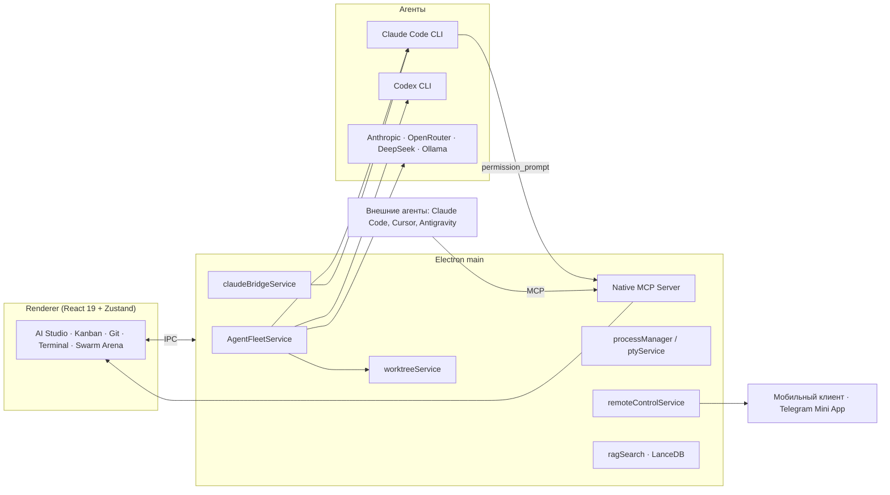

<p align="center">
  
</p>

<h1 align="center">ProjectHub</h1>

<p align="center">
  <b>Agentic Development Environment (ADE)</b><br/>
  Десктопный командный центр, в котором AI-агенты работают как полноценные участники команды, а не как автодополнение в редакторе.
</p>

<p align="center">
  
  
  
  
  
  
</p>

---

## Почему ADE, а не IDE

IDE построена вокруг одного человека, который печатает код в одном рабочем каталоге. В 2026 году это уже не то, как выглядит разработка. Код пишут агенты: Claude Code, Codex, локальные модели. Человек ставит задачи, следит за ходом работы, принимает решения в критических точках и выбирает лучший результат.

**ProjectHub** спроектирован именно под этот процесс. Это не редактор с чат-панелью сбоку, а среда, где:

- **Единица работы — задача, а не файл.** Задачи живут в `backlog/` как markdown, агент берёт их в работу, а доска обновляется в реальном времени.
- **Агентов много, и они работают параллельно.** Каждый получает свой Git Worktree, свою ветку и свой терминал. Никаких конфликтов в общем рабочем каталоге.
- **Человек остаётся в контуре.** Каждый опасный шаг агента проходит через Human-in-the-loop, и подтвердить его можно с рабочего стола, с телефона или из Telegram.
- **Среда сама является инструментом для агентов.** ProjectHub поднимает собственный MCP-сервер, через который внешние агенты управляют проектами, процессами и интерфейсом.
- **Знания проекта доступны и человеку, и машине.** Документация, архитектурные решения и задачи индексируются в векторную базу и отдаются агентам через MCP.

Один экран вместо десятка терминалов, вкладок браузера и окон Git-клиента.

---

## Что умеет ProjectHub

### 🧠 Оркестрация AI-агентов

| Модуль | Что делает |
|---|---|
| **AI Studio** | Полноэкранный агентный чат с потоковым выводом, блоками рассуждений, интерактивными карточками Tool Use и построчными Diff-карточками «Принять / Отклонить». Контекстные теги `@Task`, `@GitStatus`, `@Docs`. |
| **Мультипровайдер** | Anthropic API, OpenRouter, DeepSeek, локальная Ollama и любой OpenAI-совместимый эндпоинт. Ключи хранятся через Electron `safeStorage`. |
| **Обёртка Claude Code CLI** | AI Studio работает как GUI над Claude Code без API-ключа: дерево подагентов, индикаторы статуса на проектах в сайдбаре («работает», «ждёт решения», «завершено»), учёт квоты. |
| **Human-in-the-loop** | Разрешения Claude Code перехватываются встроенным MCP-сервером **до** выполнения инструмента. Карточка одобрения появляется в GUI, в мобильном клиенте и в Telegram. Отмена сессии = автоматический `deny`. |
| **Swarm Arena** | Одна задача отправляется сразу нескольким агентам (Fan-Out): Claude Code, Codex CLI, API-модели. Каждый агент изолирован в собственном worktree. Экран Side-by-Side показывает логи, метрики и диффы всех участников. **Pick Winner** в один клик сливает ветку победителя и чистит остальное. |
| **Handoff-конвейер** | Цепочка ролей: архитектор пишет спецификацию → кодер реализует → ревьюер проверяет. Результат каждого этапа становится входом следующего. |
| **AI-помощник для рутины** | Генерация описаний задач, сообщений коммитов и PR из контекста проекта. |

### 🌿 Git как первоклассный объект

- Граф коммитов, ветки, стеш, stage/unstage, коммиты с автопривязкой к ID задачи.
- Split / Unified Diff Viewer с подсветкой синтаксиса.
- **Git Worktrees**: создание дерева под задачу прямо из карточки (`task/<id>` → `.worktrees/<id>`), терминалы с `cwd` в worktree, диалог завершения с диффом и безопасным слиянием.
- **PR Hub**: GitHub и GitLab, создание PR из ветки задачи, статусы проверок, автоматический перевод задачи в `Review` и `Done`.

### 📋 Управление проектами поверх Backlog.md

- Автоматическое обнаружение проектов на дисках и реестр с живыми индикаторами: ветка, ahead/behind, незакоммиченные файлы, статус dev-серверов и агентов.
- Kanban и табличный вид с drag-and-drop, чеклистами Acceptance Criteria, тегами и приоритетами. Все изменения пишутся в нативный формат Backlog.md.
- Майлстоуны и дорожная карта с прогрессом по этапам.
- Документация и ADR (Architecture Decision Records) со встроенным Markdown-редактором и Mermaid-диаграммами.
- Аналитика проекта: готовность задач, контрибьюторы Git, распределение тегов, статистика векторного индекса.
- Мастер создания нового проекта из шаблона с выбором модулей инфраструктуры.

### ⚙️ Рантайм и процессы

- Менеджер фоновых процессов: dev-серверы, вотчеры, скрипты. Старт, стоп, рестарт, живые логи, защита от зависших портов.
- Встроенный мульти-терминал на `node-pty` + `xterm.js` с параллельными сессиями Claude Code и Shell в каталоге любого проекта или worktree.
- **Action Runner**: конфигурируемые кнопки Run / Test / Deploy, настройки хранятся в `.projecthub.json` проекта.
- File Explorer с Git-бейджами и быстрым редактором.

### 🔍 Знания и интероперабельность

- Векторный RAG-поиск по документации всех проектов (LanceDB + многоязычные эмбеддинги, `Ctrl+K`). Индекс коммитится в репозиторий вместе с документами.
- **ProjectHub Native MCP Server** (HTTP/SSE, `127.0.0.1:42042`, токен авторизации): переключение проектов и вкладок, отправка промптов в AI Studio, управление процессами, чтение бэклога, HITL-подтверждения. Конфигурация копируется в один клик для Claude Code, Claude Desktop, Cursor и других клиентов.
- Дружит с любым агентом, который умеет MCP: Claude Code, Google Antigravity, Cursor, Windsurf.

### 📡 Управление откуда угодно

- **Голосовое управление**: навигация, запуск процессов, коммиты, диктовка в AI Studio, hands-free режим. Web Speech API или локальный Whisper, настраиваемые фразы и синонимы, горячее переключение гарнитуры.
- **Remote Control**: мобильный веб-клиент для проектов, задач, процессов, терминала и AI Studio. Режимы LAN Direct и Server Relay (identity на Ed25519, per-device токены) со сквозным шифрованием AES-256-GCM, сопряжение по QR-коду.
- **Telegram Mini App и бот**: полноценный клиент внутри Telegram с нативными компонентами WebApp, push-уведомления о падениях процессов и запросах HITL, автоматический HTTPS-туннель, объединение нескольких машин разработчика в единый Hub.
- Глобальные горячие клавиши и палитра быстрых действий.
- Интерфейс на английском и русском с мгновенным переключением.

---

## Архитектура в двух словах



Каждый проект, которым управляет ProjectHub, устроен по единому шаблону: `backlog/` для задач и документации, коммитимый векторный индекс `.rag-index/`, менеджер процессов `env-tools`, правила и MCP-конфиги для агентов в `.claude/` и `.agents/`. ProjectHub понимает эту структуру из коробки, а мастер создания проектов разворачивает её за один шаг.

---

## Технологический стек

| Слой | Технологии |
|---|---|
| Десктоп | Electron, Vite, electron-builder |
| UI | React 19, TypeScript 6, Tailwind CSS v4, Lucide, Zustand |
| Git | simple-git, Git Worktrees, собственный diff-парсер |
| Терминал и процессы | node-pty, @xterm/xterm, tree-kill |
| AI и агенты | Anthropic API, Claude Code CLI, Codex CLI, OpenRouter, DeepSeek, Ollama, @modelcontextprotocol/sdk |
| Знания | LanceDB, @huggingface/transformers (`multilingual-e5-small`), gray-matter, Mermaid |
| Голос | Web Speech API, локальный Whisper, AudioWorklet |
| Remote | WebSocket LAN Direct/Relay, Ed25519 identity, AES-256-GCM (Web Crypto), Telegram WebApp SDK |
| Качество | ESLint (typescript-eslint, react-hooks), Vitest, валидатор документации, проверка externals бандла |

---

## Быстрый старт

Требования: **Node.js 18+** (рекомендуется 22), **Git**. Для агентных функций: установленный `claude` (Claude Code CLI) и/или `codex`, либо API-ключи провайдеров.

```bash
git clone git@github.com:Reasp/ProjectHub.git
cd ProjectHub
npm install

# режим разработки (Vite + Electron с hot reload)
npm run dev

# быстрая распакованная сборка: release/win-unpacked/ProjectHub.exe
npm run pack:win

# portable-сборка для Windows / DMG для macOS
npm run dist:win
npm run dist:mac
```

Полная проверка перед коммитом:

```bash
npm run lint:docs     # frontmatter, таблицы, картинки, актуальность RAG-индекса
npm run lint          # ESLint, 0 ошибок
npm test              # unit-тесты Vitest
npm run build         # всё вышеперечисленное + tsc + vite build + check-bundle
```

Опционально:

```bash
npm run remote-relay  # свой relay-сервер для Remote Control
npm run telegram-bot  # Telegram-бот и Mini App
npm run index-docs    # пересобрать векторный индекс документации
```

---

## CI/CD и релизы

CI (`.github/workflows/ci.yml`) гоняет полный локальный гейт (`npm run build`: validate-docs,
check-index, ESLint, Vitest, `tsc`, `vite build`, `check-bundle`) на матрице
`windows-latest` / `macos-latest` / `ubuntu-latest` на каждый PR и push в `master`, плюс
собирает распакованный `--dir`-билд на каждой ОС как артефакт (для быстрой ручной проверки, не
для распространения).

Релиз (`.github/workflows/release.yml`) запускается на тег `v*` (например `v0.2.0`): на каждой
ОС проходит тот же гейт, затем `electron-builder --publish always` собирает и публикует
дистрибутивы в GitHub Release тега вместе с `latest.yml` / `latest-mac.yml` / `latest-linux.yml`,
по которым `electron-updater` проверяет обновления:

| ОС | Форматы | Автообновление |
|---|---|---|
| Windows | `nsis` (установщик), `portable` | да (nsis) |
| macOS | `dmg`, `zip` | нет — сборка без подписи (decision-14); приложение показывает ссылку на релиз вместо автоустановки |
| Linux | `AppImage` | да |

Чтобы выпустить релиз: поднять `version` в `package.json`, закоммитить, поставить тег
(`git tag v0.2.0 && git push origin v0.2.0`) — остальное делает workflow. Токен репозитория
(`GITHUB_TOKEN`) для публикации в Releases пробрасывается Actions автоматически, отдельно
настраивать нечего.

**Защита ветки `master`**: включить в GitHub → Settings → Branches → правило для `master` —
`Require a pull request before merging` и `Require status checks to pass` с обязательной
проверкой `build (ubuntu-latest)` / `build (windows-latest)` / `build (macos-latest)` из CI.
Слияние в `master` идёт только через PR с зелёным CI; агент не коммитит и не мержит в `master`
самостоятельно (правило 9 CLAUDE.md) — это делает пользователь.

Диагностика на месте: вкладка «Диагностика» (иконка в шапке рядом с MCP) показывает версию,
проверяет обновления по кнопке и на старте, и собирает архив логов (`main.log` + ротации +
локальные crash-дампы, без отправки куда-либо — decision-7) для приложения к багрепорту.

---

## Структура репозитория

```
ProjectHub/
├── electron/
│   ├── main.ts                 # точка входа main-процесса
│   ├── ipc/                    # типизированные IPC-хэндлеры по доменам (ai, git, backlog, ...)
│   ├── services/               # agentFleetService, claudeBridgeService, mcpServerService,
│   │                           # worktreeService, processManager, ptyService, remoteControlService ...
│   └── workers/                # RAG и тяжёлые задачи в utilityProcess
├── src/
│   ├── components/             # ai (AI Studio, Swarm Arena), git, kanban, terminal, voice, remote ...
│   ├── store/                  # Zustand-сторы
│   ├── i18n/                   # en / ru
│   └── hooks/
├── scripts/
│   ├── rag/                    # индексация и MCP-сервер docs-rag
│   ├── env/                    # MCP-сервер env-tools
│   ├── remote-relay-server.mjs # relay для Remote Control
│   └── telegram-bot.mjs        # Telegram-бот
├── backlog/
│   ├── tasks/  completed/      # задачи (Backlog.md)
│   ├── docs/                   # документация проекта
│   └── decisions/              # ADR
├── tests/unit/                 # Vitest
├── .claude/  .agents/          # правила, скиллы и MCP-конфиги для Claude Code и Antigravity
└── infra.config.json           # включённые модули инфраструктуры
```

---

## Документация

- [Концепция и архитектура](backlog/docs/doc-2%20-%20Architecture-Concept.md)
- [Контекст проекта и состояние системы](backlog/docs/doc-9%20-%20Контекст-проекта-и-состояние-системы-Context-Dump.md)
- [Human-in-the-loop для Claude Code CLI](backlog/docs/doc-8%20-%20Human-in-the-loop-для-режима-Claude-CLI-в-AI-Studio.md)
- [Руководство по RAG](backlog/docs/doc-5%20-%20RAG-Guide.md)
- [Развёртывание инфраструктуры на новом проекте](backlog/docs/doc-4%20-%20Deployment-Guide.md)
- [Ревью безопасности и дорожная карта](backlog/docs/doc-6%20-%20Comprehensive-Review-Security-And-Feature-Roadmap.md)
- [ADR-1: выбор архитектуры и стека](backlog/decisions/decision-1%20-%20Vybor-Arkhitektury-I-Tekhnologicheskogo-Steka.md)
- [Правила работы с инфраструктурой для агентов](infra-dev.md)

---

## Куда это идёт

ProjectHub — это ставка на то, что следующая среда разработки будет строиться вокруг оркестрации, а не вокруг текстового редактора. Ближайшие направления:

- новые движки для Swarm Arena (Aider, OpenCode, Gemini CLI) и автоматическая оценка результатов ревью-агентом;
- политики автономности: от «подтверждать каждый шаг» до «разбудить меня, если упали тесты»;
- федерация машин и облачных раннеров как единый пул для агентов;
- сборки для Linux.

Идеи, баги и PR приветствуются.

---

## Лицензия

[MIT](LICENSE)
