# ProjectHub — Концепция и архитектура единой панели управления проектами

## 1. Введение и Проблематика

При активной разработке множества проектов с использованием локальной агентной инфраструктуры (`ProjectTemplate`) разработчик сталкивается с рядом неудобств:
- Для каждого проекта приходится открывать отдельный терминал, запускать отдельный веб-интерфейс `Backlog.md` на разных портах (`6420`, `6421`, ...).
- Браузер загромождается десятками вкладок с задачами разных репозиториев.
- Нет быстрого общего обзора ("Single Pane of Glass"): какие проекты сейчас в активной фазе, где какие задачи заблокированы или ждут проверки (`Review`), какие dev-серверы запущены прямо сейчас и потребляют ресурсы.
- Для просмотра истории коммитов, диффов и создания PR приходится переключаться в сторонние тяжелые Git-клиенты (SourceTree, GitKraken) или открывать веб-интерфейс GitHub/GitLab.
- Создание нового проекта по шаблону требует ручного запуска консольных команд и скриптов.

**ProjectHub** решает эти задачи, предоставляя единое десктопное приложение — полноценный гибрид системы управления проектами, задачами (`Backlog.md`), визуального Git-клиента, центра Pull/Merge Requests, базы знаний (`RAG/Docs`) и менеджера локального окружения (`Env Tools`).

---

## 2. Ключевые пользовательские сценарии (Use Cases)

### UC-1: Обзор и мониторинг всех проектов (All Projects Dashboard)
- Пользователь открывает ProjectHub и видит список всех своих проектов (из заданных корней, например `F:\`, `D:\Projects`, или добавленных вручную).
- Для каждого проекта наглядно отображаются:
  - Название и путь к проекту.
  - Текущая ветка Git, статус синхронизации с origin (ahead/behind), индикатор незакоммиченных изменений.
  - Сводка задач (бейдж с количеством: `To Do`, `In Progress`, `Review`, `Done`).
  - Статус запущенных процессов (например, "Dev Server running on port 3000").
  - Статус индексации документации (Vector RAG).

### UC-2: Управление задачами проекта (Backlog & Kanban View)
- Клик по проекту открывает рабочее пространство проекта:
  - **Канбан-доска**: 4 колонки (`To Do`, `In Progress`, `Review`, `Done`).
  - **Список задач с фильтрацией**: по статусу, майлстоунам, тегам, поисковому запросу.
  - **Редактор задачи**: просмотр и правка markdown-файлов задач с поддержкой frontmatter, описания, критериев приемки (Acceptance Criteria), связей и логов.
  - **Drag-and-Drop**: перетаскивание карточки задачи обновляет её статус в файловой системе (`backlog/tasks/*.md`) с соблюдением правил проекта (например, запрет перехода сразу в `Done` минуя `Review`).

### UC-3: Просмотр Git-репозитория и история коммитов (Git Graph & Diff Inspector)
- Интерактивный граф коммитов со всеми ветками (локальными и удаленными) и тегами.
- Просмотр изменений рабочей директории (Working Copy / Uncommitted changes) с подсветкой синтаксиса и режимами Unified / Split diff.
- Быстрое создание коммитов с генерацией шаблона сообщения на основе текущей задачи (например, `feat(task-3): реализация доски задач`).
- Создание веток под задачи в 1 клик (например, из карточки задачи `Создать ветку feat/task-N`).

### UC-4: Управление Pull & Merge Requests (PR / MR Lifecycle)
- Интеграция с GitHub и GitLab API (авторизация через `gh` CLI / токен).
- Просмотр списка открытых PR/MR, статусов CI/CD проверок, назначенных ревьюеров и комментариев.
- Создание Pull Request прямо из интерфейса ProjectHub с автозаполнением описания на основе markdown-файла задачи Backlog.
- Автоматическая синхронизация жизненного цикла: при открытии PR задача переходит в статус `Review`, при слиянии (merge) — переводится в `Done`.

### UC-5: Создание нового проекта из шаблона в один клик (Project Initializer Wizard)
- Пользователь нажимает кнопку `+ Новый проект`.
- Открывается мастер:
  - Выбор имени и целевой папки.
  - Выбор конфигурации фич (переключатели: `docsRag`, `envTools`, `backlogMcp`, `bootstrap`, `lightrag`).
  - Нажатие кнопки `Создать` копирует структуру `ProjectTemplate`, инициализирует git-репозиторий, запускает `setup.mjs` и добавляет проект в каталог Hub.

### UC-6: Управление процессами и логами (Process Control & Live Console)
- Прямо из интерфейса карточки проекта можно запустить `dev-server`, `build`, `test` или произвольный процесс.
- В нижней панели отображается живой вывод консоли (stdout/stderr) с возможностью остановки/перезапуска процесса.
- Интеграция с `scripts/env/process-manager.mjs` гарантирует, что процессы не потеряются между сессиями.

### UC-7: Глобальный поиск и RAG по всей базе знаний (Universal Search & Docs RAG)
- Пользователь нажимает `Ctrl+K` и вводит поисковый запрос (по ключевым словам или семантический RAG-поиск).
- Поиск находит релевантные задачи, ADR (Decisions), коммиты и разделы документации по выбранному проекту или по всем проектам сразу.

---

## 3. Архитектура приложения

```mermaid
flowchart TB
    subgraph Frontend["UI Layer (Renderer Process / React 19)"]
        Sidebar["Sidebar: Projects List & Global Actions"]
        ProjectView["Project Workspace (Kanban, Docs, Env, Settings)"]
        GitView["Git Inspector (Graph, Working Copy, Diffs, Branches)"]
        PRView["PR / MR Manager (Reviews, Checks, Create PR)"]
        Wizard["New Project Wizard Modal"]
        LogViewer["Live Terminal & Log Stream"]
        GlobalSearch["Omni Search Bar (Ctrl+K)"]
    end

    subgraph IPC["Bridge & IPC Layer (Electron IPC / Preload)"]
        API_Projects["Projects API (Scan, List, Add, Remove)"]
        API_Backlog["Backlog API (Read/Write Tasks, Milestones, Decisions)"]
        API_Git["Git API (Log Graph, Status, Diff, Branch, Commit)"]
        API_PR["PR / MR API (GitHub / GitLab Integrations)"]
        API_Process["Process API (Spawn, Kill, Tail Logs, Status)"]
        API_Template["Template API (Clone, Init, Sync Rules)"]
        API_RAG["RAG Search API (Query LanceDB / Embeddings)"]
    end

    subgraph Backend["Main Node.js Runtime & Native Services"]
        ProjectScanner["Project Discovery Service"]
        BacklogEngine["Backlog Markdown / YAML Engine"]
        GitEngine["Git Service (simple-git / libgit2)"]
        PREngine["PR Hub Service (Octokit / GitLab REST)"]
        ProcessDaemon["Process Manager Daemon (env-tools)"]
        TemplateEngine["ProjectTemplate Scaffolder"]
        LanceDBService["LanceDB Vector Query Runner"]
    end

    Frontend <--> IPC <--> Backend
```

### Слои системы:
1. **Renderer Layer (UI)**:
   - Легковесный SPA на React 19 + TypeScript + Vite.
   - Стилизация: Tailwind CSS с кастомной темной темой, стеклянными панелями (glassmorphism), плавными анимациями переходов и акцентными цветами.
   - Иконки: `lucide-react`.
   - Доска: `@dnd-kit` для плавного drag-and-drop.
   - Diff Viewer: `@git-diff-view/react` или Monaco Diff Editor для отображения изменений кода.
   - Редактор: `@uiw/react-md-editor` для редактирования задач и документации.

2. **IPC Bridge**:
   - Безопасный типизированный мост между интерфейсом и Node.js Main Process через `contextBridge.exposeInMainWorld('api', ...)`.
   - Полная TypeScript-типизация запросов и событий реального времени (логи процессов, изменения файлов через fs watcher, git status updates).

3. **Core Services (Node.js Main / Worker Processes)**:
   - `ProjectScanner`: сканирование диска, чтение `infra.config.json` и `backlog/config.yml`.
   - `BacklogEngine`: парсинг `gray-matter`, валидация схемы задач через Zod, синхронизация с файловой системой.
   - `GitEngine`: чтение графа коммитов (`git log --graph`), анализ статуса (`git status --porcelain=v2`), генерация диффов (`git diff`).
   - `PREngine`: взаимодействие с GitHub/GitLab API для получения PR, статусов CI и создания Merge Requests.
   - `ProcessDaemon`: запуск дочерних процессов (`node:child_process.spawn`), сбор stdout/stderr в буферы, трансляция событий в UI через IPC.

---

## 4. Требования к UI/UX

- **Автономность**: Никаких внешних браузеров для повседневных операций — все управление проектами, задачами и git происходит в одном окне.
- **Быстрый отклик**: Локальное кэширование метаданных проектов и git-статусов, мгновенный рендеринг.
- **Горячие клавиши**:
  - `Ctrl + K`: Глобальный поиск / палитра команд.
  - `Ctrl + N`: Создание новой задачи в текущем проекте.
  - `Ctrl + Shift + P`: Создание нового проекта из шаблона.
  - `Ctrl + G`: Переход во вкладку Git / Просмотр репозитория.
  - `Ctrl + \`: Переключение видимости панели логов.
  - `Ctrl + R`: Обновление статусов проектов и git.
