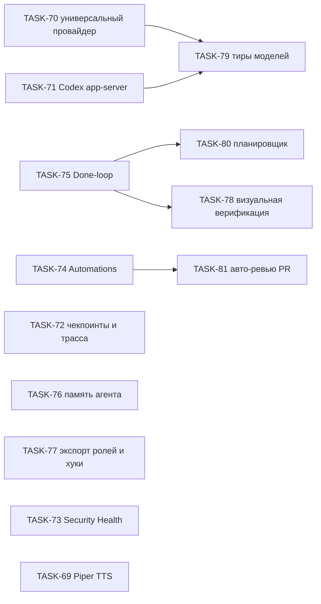

# Ландшафт агентных harness 2026 — анализ пробелов ProjectHub и план Harness 3.0

> **Дата**: "2026-09-15". **Статус**: аналитика + роадмап (milestone `Harness 3.0`, задачи TASK-69…TASK-81).
> Принятые из этого документа решения вынесены в [[decision-25]] (TTS) и [[decision-26]] (независимость
> от вендора LLM, Codex app-server, универсальный провайдер, тиры моделей); остальные ADR создаются
> в задачах, где решение принимается (правило 18).

## 0. Принцип: любая LLM, никакого «флагмана по умолчанию»

ProjectHub — local-first harness ([[decision-7]]). Его ценность в том, что он одинаково хорошо
работает с любым движком и любой моделью, которую выбрал пользователь: Claude Code CLI, Codex,
Gemini CLI, любой OpenAI-совместимый сервис, локальные модели через Ollama / LM Studio / vLLM /
llama.cpp. Требование владельца проекта (2026-09-15): **ни одна функция harness не может зависеть
от конкретной модели или вендора; GPT-6 Astra — не цель и не предпочтение.**

Следствия для всего плана ниже ([[decision-26]] п. 0):

- Done-loop, Automations, память, чекпоинты, планировщик, роли, HITL — engine- и model-agnostic.
- Модели в примерах и каталогах — справочные строки, а не дефолты. Дефолт выбирает пользователь;
  при отсутствии выбора предпочитается локальная модель.
- Цены, тиры и каталоги моделей — редактируемые данные, а не код.
- Релизы вендоров (Astra, Claude 5, Gemini) анализируются ради **тенденций** для harness, а не
  ради внедрения конкретной модели.

## 1. Что показал сентябрь 2026 (на примере GPT-6 Astra)

GPT-6 Astra выпущена OpenAI 3–4 сентября 2026 вместе с линейкой GPT-5.6 (`sol`, `terra`, `luna`);
`gpt-5.4`/`gpt-5.4-mini` сняты 31 августа. Факты — справочно, для таблицы цен и каталога:

| Параметр | Значение |
|---|---|
| API id | `gpt-6-astra` (OpenRouter: `openai/gpt-6-astra`), долгий горизонт — `gpt-6-astra-aeon` |
| Контекст / вход / выход | 1 050 000 / 922 000 / 128 000 токенов |
| Цена (стандарт) | $10 вход, $50 выход, $1 кэш-чтение за 1 млн; вход > 272 000 токенов — ×2 вход, ×1,5 выход |
| `reasoning_effort` | `low`, `medium`, `high`, `xhigh`, `max` |
| Бенчмарки | OSWorld 2.0 72,6 %, Terminal-Bench 4.0 57,9 %, ARC-AGI-3 99,9 % |
| Безопасность | первый «Critical» уровень по киберспособностям; наблюдаемость цепочки рассуждений деградировала |

Что из этого важно для harness — и одинаково применимо к любой будущей модели любого вендора:

1. **Computer use стал рабочим.** Harness, который не даёт агенту посмотреть на результат
   (запустить приложение, снять скриншот, прокликать сценарий), теряет половину ценности
   современных моделей — TASK-78.
2. **Заметки вместо сжатия контекста.** Astra ведёт структурированные «context notes» между
   окнами контекста. Это можно воспроизвести на уровне harness для всех движков: память проекта и
   заметки хода — TASK-76.
3. **Безопасность переезжает в harness.** Вендор прямо рекомендует хуки с подтверждением shell,
   `approval_policy = "untrusted"` для автоматических пайплайнов и аудит вместо чтения
   транскриптов. У ProjectHub уже есть HITL-контур и аудит-лог ([[decision-10]]); их надо
   распространить на все движки и терминальные сессии (TASK-71, TASK-77) и запретить полный
   auto-approve автономным запускам, независимо от модели ([[decision-26]] п. 7).
4. **Codex перешёл на app-server.** Все поверхности Codex работают через `codex app-server`
   (JSON-RPC 2.0: потоки, ходы, события `item/*`, запросы одобрений, `model/list`, хуки,
   субагенты, `review/start`). Наш `codex exec --json` — тупиковая ветка (TASK-71). App-server
   работает с любым `model_provider`, включая локальные серверы, то есть это движок, а не
   привязка к OpenAI.
5. **Смена поколений моделей раз в квартал.** Жёсткие id в ролях ломаются; нужен слой тиров и
   fallback (TASK-79) и универсальный провайдер с каталогом (TASK-70).

Ограничение: Codex на машине разработки не установлен и не оплачен, TASK-71 реализуется по
документации и требует ручного smoke-теста, как TASK-60.

## 2. Ландшафт harness'ов в сентябре 2026

Общий вывод обзоров 2026 года: модели внутри инструментов сошлись по качеству, разницу делает
harness. Ниже — что считается «best-in-class» по каждому направлению.

| Направление | Кто лучший | Что именно |
|---|---|---|
| Программируемость | Claude Code | хуки (PreToolUse/PostToolUse/Stop/SubagentStart/PreCompact/WorktreeCreate…), скиллы, субагенты, плагины и маркетплейс, Routines (cron/GitHub-триггеры), чекпоинты и `/rewind`, авто-память, Agent SDK с `canUseTool` |
| Охват поверхностей | Codex | app-server как единый протокол, cloud-задачи, computer use, hosted shell, tool search, плагины, `review/start` |
| Фоновые агенты | Devin, Codex Cloud, Cursor Cloud Agents, Jules | fire-and-forget задачи в изолированных VM, PR на выходе |
| Мульти-провайдерность | OpenCode (75+), Cline (30+) | любая модель, self-host |
| Приватность | Hermes, OpenHands | self-host, без телеметрии, persistent memory |
| Ревью PR | Claude `/ultrareview`, Cursor BugBot, Copilot | мульти-агентное ревью с верификацией находок |

Что есть у ProjectHub и чего нет ни у кого из них в одном месте: локальный канбан-источник истины
(Backlog.md), worktree на агента, Swarm Arena с объективным судьёй, роли как сущности, единый HITL
с аудитом, федерация машин, Remote Control/Telegram, голосовое управление, RAG по документации и
граф кода в контексте агента. Это фундамент; пробелы — ниже.

## 3. Матрица: ProjectHub против лучших практик

| Возможность | Лучшие практики | ProjectHub сейчас | Пробел → задача |
|---|---|---|---|
| Любая LLM без привязки к вендору | OpenCode/Cline: десятки провайдеров | пять провайдеров, `custom` без каталога, усилия и цен | TASK-70 |
| Маршрутизация моделей | тиры, fallback при 429 | жёсткие id в ролях | TASK-79 |
| Нативный протокол Codex | app-server JSON-RPC, одобрения, resume, усилие | `codex exec --json`, без HITL/resume | TASK-71 |
| Замкнутый контур «до готовности» | агент ↔ проверки до выполнения критериев | чеки один раз после Arena, AC отмечает агент | TASK-75 |
| Автоматизации / Routines | cron и событийные триггеры | только автозапуск назначенной задачи | TASK-74 |
| Память между сессиями | context notes, auto-memory | контекст собирается заново каждый раз | TASK-76 |
| Чекпоинты / rewind, трасса | снимок перед изменением, `/rewind`, `duration_ms` | авто-коммит результата, без отката по ходам и таймлайна | TASK-72 |
| Декомпозиция и параллель | plan mode, субагенты, автоделегирование | fan-out/handoff без подзадач | TASK-80 |
| Роли и политики вне ProjectHub | нативные субагенты и хуки | роли действуют только при запуске из ProjectHub | TASK-77 |
| Визуальная верификация / computer use | Playwright MCP, скриншоты | нет | TASK-78 |
| Автоматическое ревью PR | ultrareview, BugBot | LLM-ревьюер только в Arena | TASK-81 |
| Безопасность цепочки поставок | аудит зависимостей, сканер секретов | не реализовано (doc-6 §4.2) | TASK-73 |
| Локальный нейросетевой TTS | Piper/Kokoro оффлайн | системный `speechSynthesis` | TASK-69 |

Что уже на уровне или лучше рынка и не требует задач: worktree-изоляция ([[decision-6]]),
HITL-контур ([[decision-10]]), Arena с судьёй ([[decision-12]], [[decision-20]]), учёт
стоимости ([[decision-16]]), контекст задачи + RAG + GitNexus ([[decision-18]]), федерация и
Remote Control ([[decision-11]], [[decision-19]]), уведомления ([[decision-13]]).

## 4. План Harness 3.0 — порядок и зависимости

Рекомендуемая очередность (по ценности на единицу усилий):

1. **TASK-75 Done-loop** — самый большой прирост качества результата для любого движка и любой модели, без новых зависимостей.
2. **TASK-70 универсальный провайдер** — снимает привязку к вендорам, открывает локальные серверы и любые облачные сервисы с корректной стоимостью.
3. **TASK-76 память** и **TASK-72 чекпоинты/трасса** — «взрослая» наблюдаемость и накопление знаний.
4. **TASK-74 Automations** → **TASK-81 авто-ревью**, **TASK-79 тиры**, **TASK-77 роли/хуки**.
5. **TASK-71 Codex app-server** — когда появится оплаченный Codex; закрывает долг из [[decision-4]].
6. **TASK-80 планировщик**, **TASK-78 визуальная верификация**, **TASK-73 Security Health**, **TASK-69 Piper TTS** — по спросу.

Инварианты для всех задач: независимость от модели и вендора (§0), чистые модули с unit-тестами
(правило 17), ADR в той же задаче (правило 18), модалки через `createPortal` ([[decision-17]]),
`Done` никогда не выставляется автоматически (правило 5), полный auto-approve недоступен
автономным запускам.

## 5. Piper TTS — краткая сводка (детали в TASK-69 и [[decision-25]])

- `rhasspy/piper` заархивирован (октябрь 2025); развитие — `OHF-Voice/piper1-gpl` под GPL-3.0 (из-за espeak-ng), Python `piper-tts` 1.6.0 (июль 2026). Node-биндинга нет.
- Русские голоса: `irina`, `dmitri`, `denis`, `ruslan` (все medium, 22050 Гц, данные RHVoice, лицензия датасета «Unknown»). Kokoro-82M русский не поддерживает.
- Рантайм для Electron: `sherpa-onnx-node` 1.13.8 (Apache-2.0, prebuilt для win/linux/mac, встроенный espeak-ng, готовые конвертированные Piper-голоса) в `worker_threads` main-процесса по образцу Whisper ([[decision-21]]); запасной путь — WASM в рендерере (`@mintplex-labs/piper-tts-web`).
- Бонус против `speechSynthesis`: вывод через выбранное устройство (`setSinkId`), генерация по предложениям, отмена по `jobId`, глушение VAD на время речи.

## 6. Источники

- OpenAI — GPT-6 Astra: https://openai.com/index/gpt-6-astra/ , https://openai.com/index/safety-overview-gpt-6-astra/ , https://deploymentsafety.openai.com/gpt-6-astra
- Wikipedia — GPT-6 Astra: https://en.wikipedia.org/wiki/GPT-6_Astra
- OpenRouter — `openai/gpt-6-astra`: https://openrouter.ai/openai/gpt-6-astra
- Codex Knowledge Base — Astra в Codex CLI (лимиты, цены, хуки, context notes): https://codex.danielvaughan.com/2026/09/03/gpt-6-astra-codex-cli-configuration-context-notes-safety/
- Codex Weekly 2026-09-07 (бенчмарки, режимы цен): https://www.bighatgroup.com/blog/codex-weekly-2026-09-07/
- Codex app-server: https://github.com/openai/codex/blob/main/codex-rs/app-server/README.md , https://openai.com/index/unlocking-the-codex-harness/ , https://gist.github.com/oneryalcin/ee2c27e2d8aa040da8fbe7eebcc2ecea
- Claude Code 2026 (Routines, hooks, rewind, plugins): https://www.gradually.ai/en/changelogs/claude-code/ , https://toolsbase.dev/en/reference/claude-code-features
- Claude Agent SDK (TypeScript): https://code.claude.com/docs/en/agent-sdk/typescript
- Обзоры harness'ов 2026: https://ssojet.com/blog/ai-coding-agents-compared , https://www.firecrawl.dev/blog/best-ai-coding-agents , https://www.vellum.ai/blog/best-ai-coding-agents
- OpenAI-совместимые локальные серверы: https://github.com/ollama/ollama/blob/main/docs/openai.md
- Piper: https://github.com/OHF-Voice/piper1-gpl , https://huggingface.co/rhasspy/piper-voices/tree/main/ru/ru_RU , https://www.promptquorum.com/power-local-llm/piper-tts-review
- sherpa-onnx: https://www.npmjs.com/package/sherpa-onnx-node , https://k2-fsa.github.io/sherpa/onnx/tts/piper.html
- Локальные TTS 2026 (Kokoro без русского): https://localaimaster.com/blog/best-local-tts-models , https://contracollective.com/blog/kokoro-vs-piper-vs-xtts-local-text-to-speech-m5-max-2026
