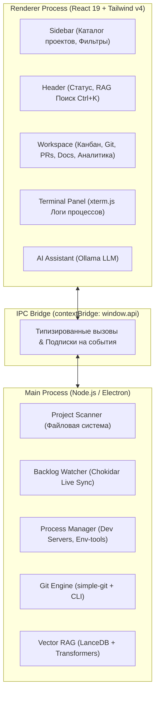

# ProjectHub — Концепция и архитектура единой панели управления проектами

## 1. Введение и Проблематика

При активной разработке множества проектов с использованием локальной агентной инфраструктуры (`ProjectTemplate`) разработчик сталкивается с рядом неудобств:
- Для каждого проекта приходится открывать отдельный терминал, запускать отдельный веб-интерфейс `Backlog.md` на разных портах (`6420`, `6421`, ...).
- Браузер загромождается десятками вкладок с задачами разных репозиториев.
- Нет быстрого общего обзора ("Single Pane of Glass"): какие проекты сейчас в активной фазе, где какие задачи заблокированы или ждут проверки (`Review`), какие dev-серверы запущены прямо сейчас и потребляют ресурсы.
- Для просмотра истории коммитов, диффов и создания PR приходится переключаться в сторонние тяжелые Git-клиенты (SourceTree, GitKraken) или открывать веб-интерфейс GitHub/GitLab.
- Создание нового проекта по шаблону требует ручного запуска консольных команд и скриптов.

**ProjectHub** решает эти задачи, предоставляя единое десктопное приложение — полноценный гибрид системы управления проектами, задачами (`Backlog.md`), визуального Git-клиента, центра Pull/Merge Requests, базы знаний (`RAG/Docs`) и менеджера локального окружения (`Env Tools`).

---

## 2. Ключевые пользовательские сценарии (Use Cases)

### UC-1: Обзор и мониторинг всех проектов (All Projects Dashboard)
- Пользователь открывает ProjectHub и видит список всех своих проектов (из заданных корней, например `F:\`, `D:\Projects`, или добавленных вручную).
- Для каждого проекта наглядно отображаются:
  - Название и путь к проекту.
  - Текущая ветка Git, статус синхронизации с origin (ahead/behind), индикатор незакоммиченных изменений.
  - Сводка задач (бейдж с количеством: `To Do`, `In Progress`, `Review`, `Done`).
  - Статус запущенных процессов (например, "Dev Server running on port 3000").
  - Статус индексации документации (Vector RAG).

### UC-2: Интерактивная Канбан-доска задач (`Backlog.md`)
- Выбрав проект, разработчик переходит на вкладку **Задачи**.
- Отображаются колонки: `To Do`, `In Progress`, `Review`, `Done`.
- Возможности:
  - Drag-and-Drop карточек с мгновенным обновлением `status` в frontmatter markdown-файлов задач.
  - Клик по задаче открывает модальное окно деталей: редактирование заголовка, меток (`labels`), чек-листа Acceptance Criteria (`- [ ]`), описания и заметок.
  - Создание новой задачи: генерирует файл `backlog/tasks/task-X - Title.md` с валидным YAML frontmatter.
  - Автоматическая двусторонняя синхронизация: если AI-агент меняет статус задачи на диске через CLI/MCP, карточка на доске передвигается в реальном времени (через `chokidar` watcher).

### UC-3: Визуальный Git-инспектор и управление изменениями
- Просмотр графа коммитов репозитория.
- Просмотр измененных файлов в рабочей копии (`git status`), стейджинг файлов (`git add`), создание коммитов с форматированным сообщением.
- Интерактивный Side-by-Side и Inline Diff просмотр изменений файлов перед фиксацией.

### UC-4: Менеджер Pull & Merge Requests
- Просмотр существующих PR/MR в репозитории (GitHub / GitLab / локальные ветки).
- Создание Pull Request: генерация заголовка, описания изменений (с интеграцией AI Assistant), выбор целевой ветки и автоматическое открытие через `gh pr create` / `glab mr create` / API.

### UC-5: База знаний и документация (Docs & Vector RAG)
- Просмотр и редактирование markdown-документов проекта (`backlog/docs/`) и архитектурных решений (`backlog/decisions/`).
- Полнотекстовый и семантический поиск по всей базе знаний через встроенный LanceDB Vector RAG.
- Кнопка быстрой переиндексации (`npm run index-docs`) прямо из UI.

### UC-6: Управление локальными процессами и встроенный терминал
- Запуск и остановка dev-серверов, фоновых сборщиков и скриптов окружения (`env-tools`).
- Встроенный интерактивный терминал (`xterm.js`) с поддержкой ANSI-цветов, копирования логов и очистки.
- Отображение статусов и портов работающих служб.

### UC-7: Мастер создания новых проектов (New Project Wizard)
- Интерактивная форма инициализации проекта на базе `ProjectTemplate`:
  - Выбор директории и имени проекта.
  - Выбор подключаемых модулей (Docs RAG, Backlog MCP, Env-Tools, Bootstrap).
  - Автоматическое создание структуры папок, `backlog/`, `.agents/`, `.mcp.json`, `infra.config.json` и `git init`.

---

## 3. Архитектура системы

ProjectHub построен по модульной архитектуре Electron + Vite + React 19:



```
┌─────────────────────────────────────────────────────────────┐
│                 Renderer Process (React 19)                 │
│  - Sidebar: Каталог проектов, быстрые фильтры               │
│  - Header: Статус проекта, глобальный поиск (Ctrl+K)        │
│  - Workspace: Вкладки (Канбан, Майлстоуны, Git, PRs, Docs) │
│  - TerminalPanel: Интерактивный вывод процессов             │
│  - AI Assistant: Генерация задач, коммитов, PR              │
└──────────────────────────────┬──────────────────────────────┘
                               │ IPC (contextBridge: window.api)
┌──────────────────────────────▼──────────────────────────────┐
│                  Main Process (Node.js/Electron)            │
│  - Project Registry: Хранение путей и избранных проектов    │
│  - Project Scanner: Быстрое сканирование файловой системы   │
│  - Backlog Watcher: Мониторинг задач через chokidar         │
│  - Process Manager: Контроль дочерних процессов и логов     │
│  - Git Service: Интеграция с simple-git и gh/glab CLI       │
│  - Docs & RAG Service: Индексация и поиск LanceDB           │
│  - Milestone Service: Дорожные карты и прогресс             │
└─────────────────────────────────────────────────────────────┘
```
