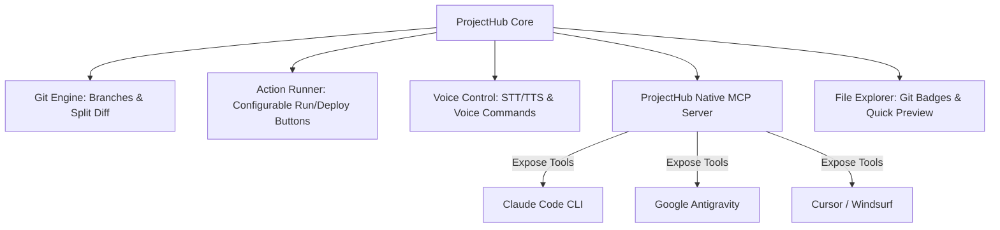
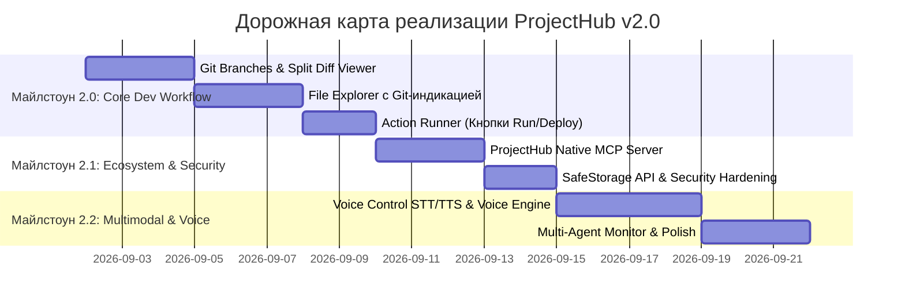

# Комплексное ревью функционала, аудит уязвимостей и дорожная карта развития ProjectHub

> **Версия**: 2.0-PROPOSAL  
> **Статус**: Архитектурная спецификация и план развития  
> **Цель**: Проведение детального ревью имеющегося функционала ProjectHub, выявление архитектурных и уязвимых мест, а также формализация требований и дорожной карты внедрения новых критических модулей (Git Diffs & Branches, Action Runner, Voice Control, ProjectHub MCP Server, Git-aware File Explorer).

---

## 1. Архитектурное ревью текущего функционала

На текущий момент в ProjectHub реализовано и интегрировано **17 функциональных модулей** на стеке **Electron + Vite + React 19 + TypeScript + Tailwind CSS v4 + Zustand**:

| # | Модуль | Текущее состояние | Сильные стороны | Ограничения и зоны роста |
|---|---|---|---|---|
| 1 | **Project Discovery & Registry** | `task-2` (Done) | Автосканирование папок, фавориты, подсчет задач и git-статуса | Нет виртуализации при >50 проектах, нет группировки по категориям/тегам |
| 2 | **Kanban & Backlog Viewer** | `task-3` (Done) | Канбан To Do / In Progress / Review / Done, Acceptance Criteria | Нет drag-and-drop сортировки карточек внутри колонки |
| 3 | **Template Wizard** | `task-4` (Done) | Создание проектов из шаблона `ProjectTemplate` с выбором фич | Шаблон пока жестко привязан к локальному репозиторию |
| 4 | **Process Manager & Terminal** | `task-5` (Done) | Запуск dev-серверов, логирование stdout/stderr, pid tracking | Нет перезапуска по вотчеру, нет настройки переменных окружения в UI |
| 5 | **Vector RAG Search** | `task-6` (Done) | Поиск по LanceDB, `Ctrl+K`, семантическая релевантность | Требуется предварительная ручная индексация документов |
| 6 | **Git Inspector** | `task-7` (Done) | Базовый лог, стейджинг файлов, простой diff, коммиты с AI | Нет переключения веток, нет сравнения веток, diff только unified |
| 7 | **Pull Requests Hub** | `task-8` (Done) | Интеграция с GitHub CLI (`gh`), список и создание PR | Ограничен GitHub CLI, нет GitLab/Bitbucket токенов |
| 8 | **Docs & ADR Editor** | `task-9` (Done) | Просмотр и редактирование Markdown документов и ADR | Нет дерева файлов папки `docs`, только плоский список |
| 9 | **Milestones & Roadmap** | `task-10` (Done) | Прогресс-бары, привязка задач, фильтры доски | Нет диаграммы Ганта / таймлайна сроков |
| 10 | **Shortcuts & Palette** | `task-11` (Done) | `Ctrl+K`, `Ctrl+B`, `Ctrl+G`, `Ctrl+I`, `Ctrl+\` | Пользователь не может переназначать горячие клавиши |
| 11 | **Analytics Dashboard** | `task-12` (Done) | Графики готовности, теги, авторы коммитов, AC трекинг | Нет экспорта отчетов в PDF/CSV |
| 12 | **AI Assistant & Widgets** | `task-13` (Done) | Генерация описаний задач, коммитов через Ollama | Только базовые шаблоны промптов |
| 13 | **Embedded PTY Terminal** | `task-14` (Done) | Полноценный xterm.js + node-pty, мульти-вкладки, Claude Code | Терминал не сохраняет буфер между перезапусками приложения |
| 14 | **Claude Studio & Multi-LLM** | `task-15` (Done) | Claude 3.7 Sonnet, DeepSeek, OpenRouter, Ollama, Diff cards | Нет голосового ввода промптов и диктовки |
| 15 | **i18n Localization** | `task-16` (Done) | Полная поддержка английского (`en`) и русского (`ru`) языков | Требуется синхронное добавление ключей для новых страниц |

---

## 2. Анализ уязвимостей, рисков и узких мест (Security & Stability Audit)

В ходе углубленного аудита кодовой базы ProjectHub были выявлены следующие потенциально уязвимые и узкие места:

### 2.1. Безопасность выполнения команд (Command Injection & Arbitrary Code Execution)
- **Уязвимость**: `processManager.ts`, `ptyService.ts` и `templateWizard.ts` используют `spawn` с флагом `shell: true` или запуск интерактивных команд.
- **Риск**: Если имя проекта, аргументы команды или кастомный скрипт содержат спецсимволы shell (например, `;`, `&&`, `|`, `` ` ``), возможен перехват управления и выполнение произвольного кода.
- **Решение**: Использовать `execFile` / `spawn` с массивом аргументов без `shell: true`, либо внедрить строгую валидацию и экранирование входных данных.

### 2.2. Небезопасное хранение API-ключей (Insecure Secret Storage)
- **Уязвимость**: Ключи доступа к Anthropic Claude, OpenRouter, OpenAI и DeepSeek в `aiAgentService.ts` сохраняются в `localStorage` браузера или в открытых JSON-конфигах.
- **Риск**: Любая XSS-уязвимость, вредоносный npm-пакет или локальный процесс может прочитать секретные API-ключи в открытом виде.
- **Решение**: Интегрировать нативное Electron API `safeStorage` (использует DPAPI в Windows, Keychain в macOS, Libsecret в Linux) для шифрования всех API-ключей перед записью на диск.

### 2.3. Path Traversal при операциях с файлами
- **Уязвимость**: В `docsService.ts`, `gitService.ts` и операциях чтения файлов пути приходят из рендерера и обрабатываются через `path.join`.
- **Риск**: Передача путей вида `../../Windows/System32` или выход за пределы папки проекта может позволить чтение или перезапись системных файлов.
- **Решение**: Проверять, что разрешенный абсолютный путь `resolvedPath.startsWith(projectRootPath)` перед выполнением любых операций `fs.readFile` или `fs.writeFile`.

### 2.4. Исчерпание файловых дескрипторов и утечки памяти (Watcher Overhead)
- **Уязвимость**: `chokidar` запускается на корнях проектов и может захватывать глубокие директории при неполном списке исключений.
- **Риск**: На репозиториях с тяжелыми папками сборки (например, `target/`, `.cache/`, `.next/`, `venv/`) процесс Electron начинает потреблять до 1-2 ГБ RAM и 100% CPU.
- **Решение**: Расширить список `ignored` паттернов в `gitService.ts` и `backlogWatcher.ts`, ограничить глубину вотчера и добавить отписку при переключении активного проекта.

### 2.5. Concurrency и гонки данных (Race Conditions)
- **Уязвимость**: Одновременная модификация файлов `backlog/tasks/*.md` через графический интерфейс ProjectHub, параллельный PTY-терминал Claude Code и фоновые Git-операции.
- **Риск**: Затирание изменений или конфликтные перезаписи файлов задач.
- **Решение**: Внедрить транзакционные файловые блокировки (`file-lock` / `stale-while-revalidate` по mtime) перед записью изменений.

---

## 3. Спецификация новых запрошенных модулей

Ниже приведено детальное проектирование функционала, запрошенного пользователем, с архитектурой и интерфейсными решениями:



### 3.1. Модуль: Продвинутый Git — Ветки и Отображение Диффов (Git Diffs & Branches)

#### Назначение
Предоставить пользователю полноценные возможности версионирования без необходимости открывать сторонние клиенты (SourceTree, GitKraken).

#### Ключевые возможности:
1. **Интерактивный менеджер веток (Branch Switcher & Manager)**:
   - Выпадающий список текущей ветки в шапке вкладки Git и статус-баре.
   - Быстрое переключение веток (`git checkout`).
   - Создание новой ветки от текущей с валидацией имени.
   - Слияние веток (`git merge`), просмотр конфликтов.
   - Удаление локальных веток с подтверждением.
   - Список удаленных веток (`origin/*`) и кнопка `Fetch / Pull / Push`.
2. **Продвинутый Diff Viewer (Visual Diff Engine)**:
   - Переключение между режимами **Unified** (в одну колонку) и **Split / Side-by-Side** (в две параллельные колонки).
   - Построчная и посимвольная подсветка добавленных (`+` зеленый) и удаленных (`-` красный) фрагментов.
   - Синтаксическая подсветка кода внутри диффа (TypeScript, JavaScript, Python, CSS, JSON, Markdown).
   - Выборочный стейджинг (Stage / Unstage конкретных строк или ханков кода `Hunk`).
   - Сравнение произвольных коммитов и веток (Diff между веткой `feature` и `main`).

---

### 3.2. Модуль: Кнопки Запуска и Деплоя с конфигурируемыми скриптами (Action Runner & Deploy Hub)

#### Назначение
Быстрый запуск жизненного цикла проекта в один клик прямо из шапки активного проекта.

#### Ключевые возможности:
1. **Быстрые кнопки в панели проекта**:
   - Кнопка **«▶ Запуск» (Run / Dev)** — запуск локального сервера разработки (например, `npm run dev` или `python main.py`).
   - Кнопка **«🚀 Деплой» (Deploy)** — запуск скрипта сборки и публикации (например, `npm run deploy`, `docker compose up -d`, `vercel --prod`).
   - Кнопка **«🧪 Тесты» (Test)** — быстрый запуск прогона тестов (`npm test`, `pytest`).
   - Кнопка **«⚙ Конфигурация»** — открытие модального окна настройки команд.
2. **Конфигурация скриптов (`.projecthub.json` или реестр)**:
   ```json
   {
     "actions": {
       "run": {
         "name": "Dev Server",
         "command": "npm run dev",
         "autoOpenUrl": "http://localhost:5173",
         "cwd": "."
       },
       "deploy": {
         "name": "Production Deploy",
         "command": "npm run build && npm run deploy:prod",
         "requiresConfirmation": true,
         "env": { "NODE_ENV": "production" }
       },
       "test": {
         "name": "Unit Tests",
         "command": "npm test"
       }
     }
   }
   ```
3. **Визуализация состояния**:
   - Анимированный спиннер при выполнении скрипта.
   - Бейдж статуса (зеленый пульсирующий индикатор, если dev-сервер активен).
   - Выпадающая шторка терминала с логами запущенного действия.
   - Кнопка «Остановить процесс» при активном запуске.

---

### 3.3. Модуль: Полное голосовое управление (Voice Control Engine)

#### Назначение
Управление всеми ключевыми функциями ProjectHub и диктовка промптов голосом без использования клавиатуры.

#### Архитектура голосового движка:
1. **Распознавание речи (STT — Speech-to-Text)**:
   - Режим по умолчанию: **Web Speech API** (мгновенное локальное/браузерное распознавание без задержек и без сторонних ключей).
   - Опциональный режим высокой точности: **Локальный Whisper** (`whisper.cpp` / `faster-whisper`) или **OpenAI Whisper API**.
2. **Голосовые команды (Voice Commands Intent Parser)**:
   - *Навигация*: «Открой бэклог», «Перейди в Git», «Покажи аналитику», «Открой терминал», «Переключись на проект X».
   - *Действия*: «Запусти проект», «Останови сервер», «Сделай коммит с сообщением...», «Создай задачу...», «Задеплой проект».
   - *Управление AI*: «Спроси ассистента...», «Очисти контекст», «Примени изменения диффа».
3. **Голосовой ввод в AI Studio и редакторах (Speech Dictation)**:
   - Кнопка микрофона в строке ввода промпта Claude AI Studio и Markdown-редакторе документов.
   - Интеллектуальная расстановка знаков препинания и удаление слов-паразитов.
4. **Синтез речи (TTS — Text-to-Speech)**:
   - Озвучивание ключевых ответов AI-ассистента и системных уведомлений (Web Speech Synthesis / локальный Silero TTS).
5. **Режимы активации**:
   - **Push-to-Talk**: удержание горячей клавиши (например, `Ctrl+Shift+V` или `Caps Lock`).
   - **Voice Activity Detection (VAD)** с распознаванием ключевой фразы активации («Привет, Хаб»).

---

### 3.4. Модуль: Встроенный универсальный MCP-сервер ProjectHub (Full ProjectHub MCP Server)

#### Назначение
Предоставление внешним AI-агентам (Claude Code, Google Antigravity, Cursor, Windsurf, OpenCode) полного набора инструментов для программного управления ProjectHub.

#### Набор экспортируемых MCP-инструментов:

| Категория | MCP Tool Name | Описание инструмента |
|---|---|---|
| **Проекты** | `projecthub_list_projects` | Получение списка всех проектов в хабе со статусами и путями |
| | `projecthub_get_project_details` | Детальная информация об активном проекте (git, задачи, процессы) |
| | `projecthub_switch_project` | Программное переключение активного проекта в GUI |
| **Процессы и Скрипты** | `projecthub_run_action` | Запуск скрипта (run/deploy/test/custom) с потоковым возвратом логов |
| | `projecthub_stop_process` | Остановка запущенного процесса по имени или ID |
| | `projecthub_get_process_logs` | Чтение последних строк лога любого процесса |
| **Git Управление** | `projecthub_git_status` | Полный статус файлов репозитория со стейджингом |
| | `projecthub_git_diff` | Получение diff для файла, коммита или между ветками |
| | `projecthub_git_commit` | Создание коммита с автоматической привязкой к Backlog |
| | `projecthub_git_branch` | Создание, переключение или слияние веток |
| **Backlog & Задачи** | `projecthub_task_create` | Создание новой задачи с критериями приемки |
| | `projecthub_task_update_status` | Перевод задачи (`To Do` → `In Progress` → `Review` → `Done`) |
| | `projecthub_get_kanban` | Получение полной доски задач проекта |
| **Интерфейс и Голос** | `projecthub_notify` | Отправка всплывающего уведомления пользователю в десктоп |
| | `projecthub_voice_speak` | Воспроизведение голосового сообщения пользователю через TTS |

---

### 3.5. Модуль: Интерактивный File Explorer с Git-индикацией (Git-Aware File Tree)

#### Назначение
Полноценный файловый менеджер проекта, встроенный в боковую панель или рабочую область, с визуальной подсветкой измененных файлов по Git.

#### Ключевые возможности:
1. **Дерево файлов и папок (VS Code-like Tree View)**:
   - Иерархическое отображение папок с раскрытием/сворачиванием.
   - Иконки типов файлов (TypeScript, React, CSS, Markdown, JSON, Shell, Python и т.д.).
   - Автоматическое скрытие служебных директорий (`node_modules`, `.git`, `dist`, `.rag-index`).
2. **Git-статусы и цветовая индикация**:
   - **`[M]` (Желтый / Оранжевый)** — Модифицированный файл (Modified).
   - **`[A]` (Зеленый)** — Добавленный / подготовленный файл (Added/Staged).
   - **`[D]` (Красный)** — Удаленный файл (Deleted).
   - **`[?]` (Серый / Неоновый)** — Неотслеживаемый новый файл (Untracked).
   - **`[!]` (Ярко-красный)** — Конфликт слияния (Conflict).
   - Подсветка родительских папок, если внутри них есть измененные файлы.
3. **Быстрые действия с файлами**:
   - Одиночный клик по модифицированному файлу открывает встроенный Diff Viewer.
   - Одиночный клик по обычному файлу открывает быстрый встроенный просмотрщик/редактор.
   - Контекстное меню: «Открыть в проводнике», «Открыть в терминале», «Копировать относительный путь», «Создать файл», «Удалить файл».

---

## 4. Дополнительные архитектурные предложения (Beyond Expectations)

В дополнение к запрошенным модулям рекомендуется включить следующие расширения:

1. **Мульти-агентный монитор оркестрации (Multi-Agent Live Monitor)**:
   - Дашборд запущенных субагентов и параллельных процессов (Claude Code + Antigravity).
   - Визуальное дерево задач с индикатором «Кто над чем сейчас работает».
2. **Автоматический аудит безопасности зависимостей (Security Health Check)**:
   - Встроенная проверка `npm audit` / уязвимостей пакетов с выводом степени критичности (Critical, High, Moderate).
   - Сканер секретов (предотвращение коммита API-ключей, `.env` файлов и токенов).
3. **Панель системных ресурсов и портов (Live Resource Monitor)**:
   - Отображение занятых портов (`3000`, `5173`, `8000`) с кнопкой освобождения порта (Kill Port).
   - Мониторинг потребления CPU и RAM запущенными dev-серверами.

---

## 5. Пошаговая дорожная карта реализации (Implementation Roadmap)



### Этап 1: Core Dev Workflow (Майлстоун 2.0)
- Реализация полноценного `BranchManager` и `SplitDiffViewer` на базе `simple-git`.
- Внедрение компонента `FileExplorer` с подпиской на события `git:changed` и бейджами файлов.
- Реализация панели `ActionRunner` в шапке проекта с запуском настраиваемых команд через `processManager`.

### Этап 2: Ecosystem & Security (Майлстоун 2.1)
- Разработка нативного MCP-сервера ProjectHub (`electron/services/mcpServer.ts`), экспортирующего инструменты для AI-агентов.
- Интеграция Electron `safeStorage` для шифрования всех API-ключей.
- Санитизация аргументов терминальных команд и валидация путей `Path Traversal`.

### Этап 3: Voice & Multimodal (Майлстоун 2.2)
- Внедрение `VoiceService` с поддержкой Web Speech API и голосовых команд.
- Интеграция кнопки голосового ввода в Claude AI Studio и строку команд.
- Добавление озвучивания ответов через TTS.
- Тестирование и валидация сборки распакованного десктопного бинарника (`npm run pack:win`).

---

## 6. Заключение

Предложенная архитектура превращает ProjectHub из каталога проектов в **универсальную интеллектуальную операционную панель разработчика (Developer Cockpit)**, объединяющую визуальный контроль кода, управление инфраструктурой, многоагентную среду и голосовой интерфейс.
